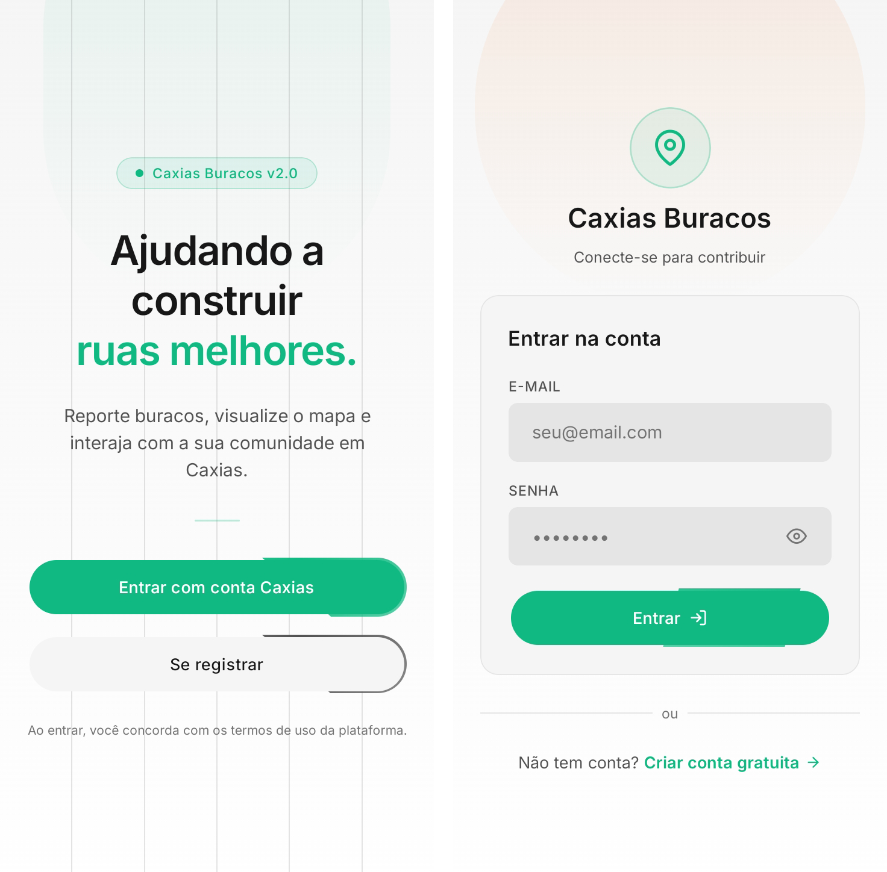
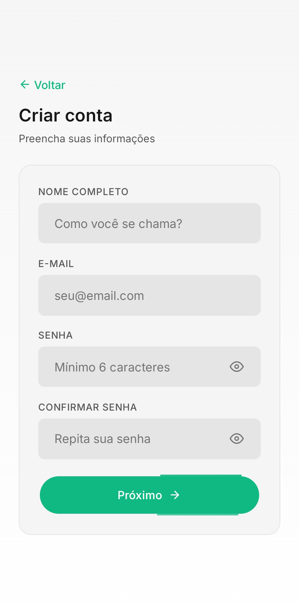
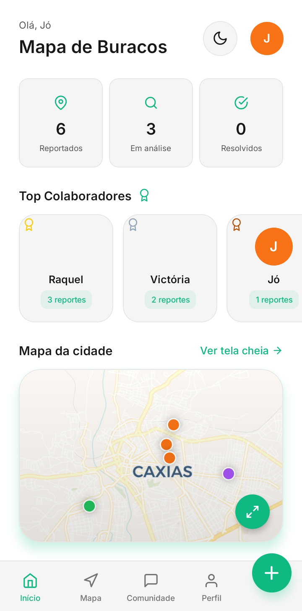
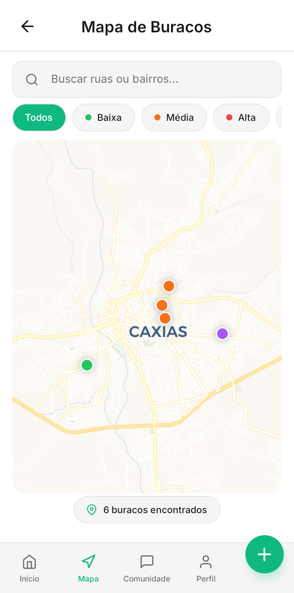
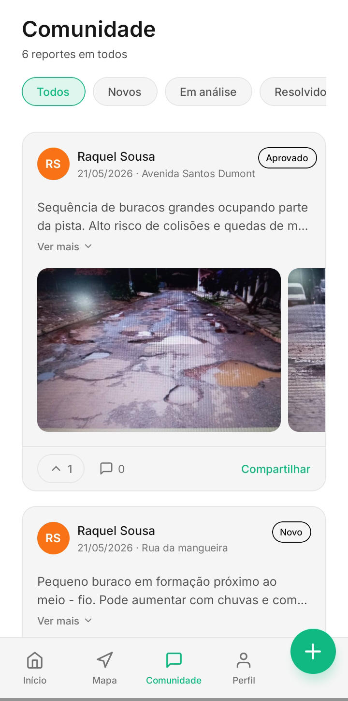
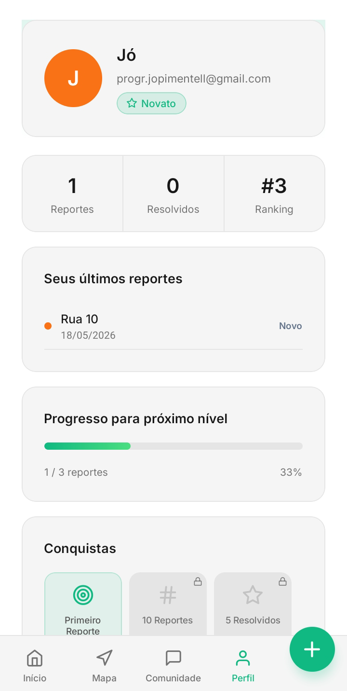
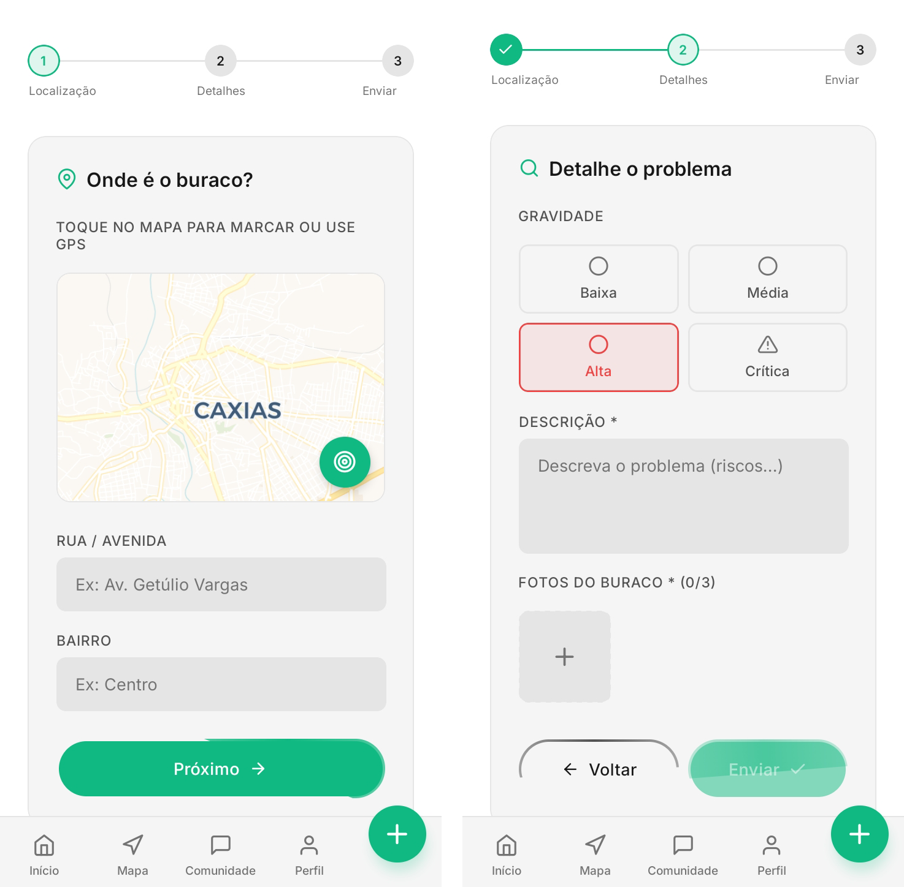
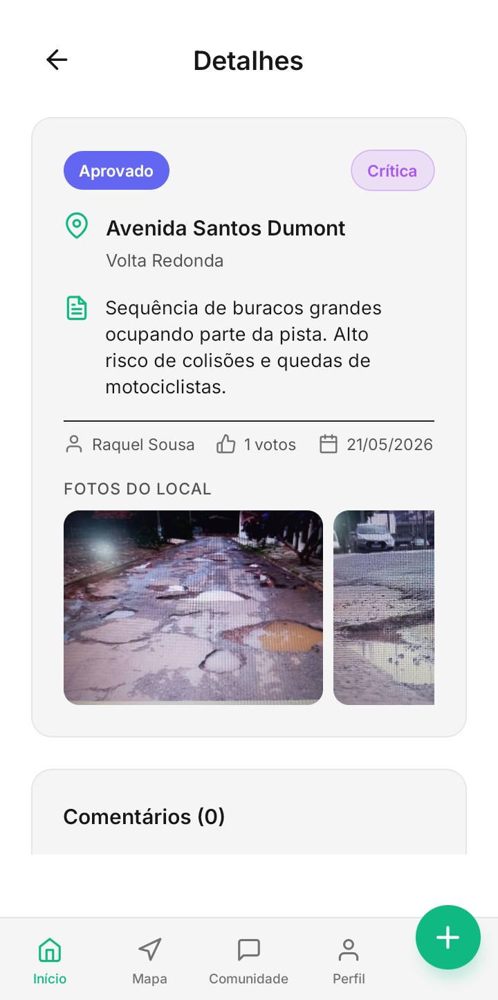

# Sistema de Mapeamento de Buracos Urbanos
Aplicativo colaborativo para reporte de problemas de infraestrutura urbana

---

## Sobre o Projeto

Aplicativo mobile que permite cidadãos reportarem buracos e problemas no asfalto de forma colaborativa, conectando população e poder público com acompanhamento em tempo real.

### 🎯 Objetivos Acadêmicos

| Objetivo | Descrição |
|----------|-----------|
| **Desenvolvimento Mobile** | Aplicação completa com React Native |
| **Geolocalização** | Captura de localização e mapas interativos |
| **Mídia** | Upload de imagens diretamente do dispositivo |
| **Autenticação** | Sistema seguro de login e perfis |
| **Backend** | Utilização de BaaS (Backend as a Service) |

---

## Screenshots do Sistema

### Fluxo de Autenticação

| Tela de Login | Tela de Cadastro |
|:-------------:|:----------------:|
|  |  |
| Acesso com e-mail e senha | Criação de nova conta com avatar |

---

### Home / Dashboard Inicial

| Visão Geral da Home |
|:-------------------:|
|  |
| Cards de estatísticas (reportados/em análise/resolvidos) + Ranking de colaboradores + Pré-visualização do mapa |

---

### Mapa e Comunidade

| Mapa de Buracos | Feed da Comunidade |
|:---------------:|:------------------:|
|  |  |
| Visualização geolocalizada dos buracos com marcadores coloridos | Listagem de reportes com votos, comentários e status |

---

### Perfil do Usuário

| Visão Geral do Perfil |
|:---------------------:|
|  |
| Informações do usuário, estatísticas (reportes/resolvidos/ranking), barra de progresso e conquistas desbloqueadas |

---

### Telas Complementares

| Tela de Reporte | Detalhes do Buraco |
|:---------------:|:------------------:|
|  |  |
| Formulário para novo reporte com upload de imagens | Visualização detalhada com comentários e ações de admin |

---

## Arquitetura

```
┌─────────────────────────────────────────────────────────────┐
│                      Arquitetura do Sistema                  │
├─────────────────────────────────────────────────────────────┤
│                                                              │
│  📱 Frontend                     ☁️ Backend                 │
│  ┌──────────────────┐            ┌──────────────────┐       │
│  │  React Native    │ ◄────────► │    PostgreSQL    │       │
│  │  + Expo          │   HTTPS    │  (Banco de       │       │
│  │                  │            │   Dados)         │       │
│  └──────────────────┘            └──────────────────┘       │
│         │                                  │                 │
│         │                           ┌──────┴──────┐          │
│         │                           │  Supabase   │          │
│         │                           │Auth/Storage │          │
│         │                           └─────────────┘          │
└─────────────────────────────────────────────────────────────┘
```

### Tecnologias

| Camada | Tecnologia | Finalidade |
|--------|------------|------------|
| **Frontend** | React Native + Expo | Framework mobile |
| | Expo Router | Navegação entre telas |
| | NativeWind (Tailwind) | Estilização e temas |
| | Leaflet + WebView | Mapas interativos |
| **Backend** | Supabase | Backend as a Service |
| | PostgreSQL 15 | Banco de dados relacional |
| | Supabase Auth | Autenticação JWT |
| | Supabase Storage | Armazenamento de imagens |

---

## 📂 Estrutura do Projeto

```
tapaBC2.0/
├── mobile/                              # Frontend React Native
│   ├── assets/
│   │   └── screenshots/                 # 📸 Imagens da documentação
│   │       ├── login-screen.png
│   │       ├── register-screen.png
│   │       ├── home-screen.png
│   │       ├── map-screen.png
│   │       ├── feed-screen.png
│   │       ├── profile-screen.png
│   │       ├── report-screen.png
│   │       └── report-detail-screen.png
│   ├── src/
│   │   ├── screens/                     # Telas do aplicativo
│   │   │   ├── HomeScreen.tsx           # Mapa + lista de buracos
│   │   │   ├── ReportScreen.tsx         # Formulário de reporte
│   │   │   ├── FeedScreen.tsx           # Comunidade (comentários)
│   │   │   ├── ProfileScreen.tsx        # Perfil + conquistas
│   │   │   ├── LoginScreen.tsx          # Autenticação
│   │   │   └── ReportDetailScreen.tsx   # Detalhes do buraco
│   │   ├── context/                     # Estado global
│   │   │   ├── AuthContext.tsx          # Autenticação
│   │   │   ├── ReportsContext.tsx       # Gestão de reportes
│   │   │   └── ThemeContext.tsx         # Tema claro/escuro
│   │   ├── components/                  # Componentes reutilizáveis
│   │   │   ├── UserAvatar.tsx
│   │   │   ├── LeafletMap.tsx
│   │   │   └── BeamButton.tsx
│   │   └── services/
│   │       └── supabase.ts              # Cliente Supabase
│   ├── App.tsx
│   ├── package.json
│   └── app.json
│
└── README.md
```

---

## Modelo de Dados

### Entidades Principais

| Tabela | Descrição | Campos Principais |
|--------|-----------|-------------------|
| `profiles` | Perfis de usuário | id, name, handle, role |
| `reports` | Reportes de buracos | id, street, description, severity, status, votes |
| `report_images` | Imagens dos reportes | id, report_id, image_url |
| `votes` | Votos dos usuários | user_id, report_id |
| `comments` | Comentários | id, report_id, user_id, content |

### Segurança (RLS)

- **SELECT**: Usuários autenticados podem ler
- **INSERT**: Apenas o próprio usuário
- **UPDATE/DELETE**: Apenas o dono ou administrador

---

## Funcionalidades

### Autenticação
- Cadastro e login com email/senha
- Sessão persistente
- Diferenciação usuário comum / administrador

### Reporte de Buracos
- Captura de localização (GPS ou toque no mapa)
- Upload de até 3 imagens
- Seleção de gravidade (Baixa/Média/Alta/Crítica)

### Feed e Interação
- Listagem com filtros (todos/em análise/resolvidos)
- Sistema de votos (um por usuário)
- Comentários em reportes

### 🎮 Gamificação
- Ranking de colaboradores (Top 5)
- Níveis progressivos
- Conquistas desbloqueáveis

### 🗺️ Mapa
- Marcadores coloridos por gravidade
- Popup com informações
- Filtros e busca

---

## Papéis e Permissões

| Funcionalidade | Usuário | Admin |
|----------------|:-------:|:-----:|
| Criar reporte | ✅ | ✅ |
| Deletar próprio reporte | ✅ | ✅ |
| Deletar qualquer reporte | ❌ | ✅ |
| Aprovar/Rejeitar/Resolver | ❌ | ✅ |

---

## Instalação

### Pré-requisitos
- Node.js 18+
- npm ou yarn
- Expo CLI
- Conta no [Supabase](https://supabase.com)

### Passo a passo

```bash
# 1. Clonar o repositório
git clone https://github.com/ThiagoLachowski/tapaBC2.0.git
cd tapaBC2.0

# 2. Instalar dependências
cd mobile
npm install

# 3. Configurar ambiente
# Criar arquivo .env na pasta mobile com:
EXPO_PUBLIC_SUPABASE_URL=sua_url_do_supabase
EXPO_PUBLIC_SUPABASE_ANON_KEY=sua_chave_anon

# 4. Executar
npx expo start -c
```

### Teste no dispositivo

1. Instale **Expo Go** (Play Store/App Store)
2. Escaneie o QR Code gerado
3. Crie uma conta e comece a usar

### Definir Administrador

```sql
-- Executar no SQL Editor do Supabase
UPDATE profiles SET role = 'admin' 
WHERE id = (SELECT id FROM auth.users WHERE email = 'admin@exemplo.com');
```

---

## Validação

| Cenário | Resultado |
|---------|:---------:|
| Cadastro de novo usuário | ✅ |
| Login com credenciais válidas | ✅ |
| Upload de imagem no reporte | ✅ |
| Votar em um reporte | ✅ |
| Comentar em reporte | ✅ |
| Admin aprova reporte | ✅ |

---

## Decisões Técnicas

| Decisão | Motivo |
|---------|--------|
| **Supabase vs Backend próprio** | Reduz complexidade, fornece autenticação e storage prontos, foco no frontend |
| **RLS (Row Level Security)** | Segurança no nível do banco, regras declarativas, impede acesso indevido |
| **Leaflet + WebView** | Popups personalizáveis, controle total da renderização |
| **Expo** | Agiliza desenvolvimento, facilita testes no dispositivo |

---

**Repositório:** [github.com/ThiagoLachowski/tapaBC2.0](https://github.com/ThiagoLachowski/tapaBC2.0)